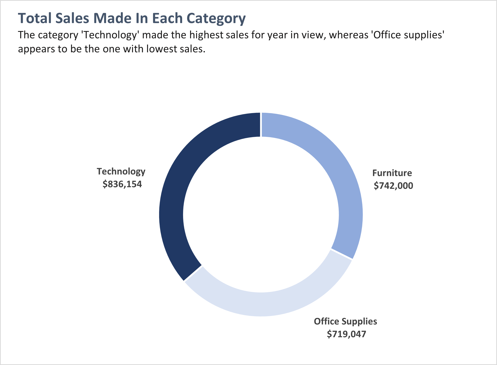
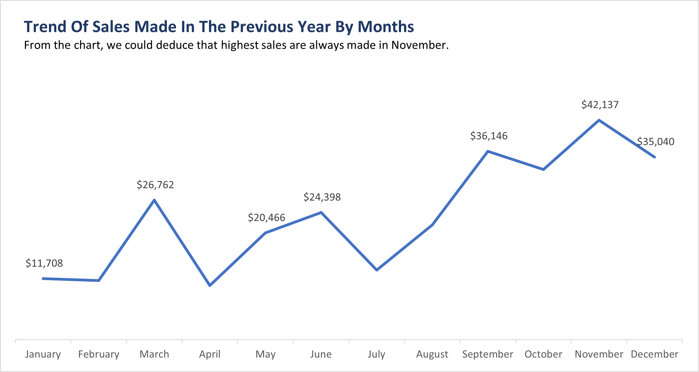
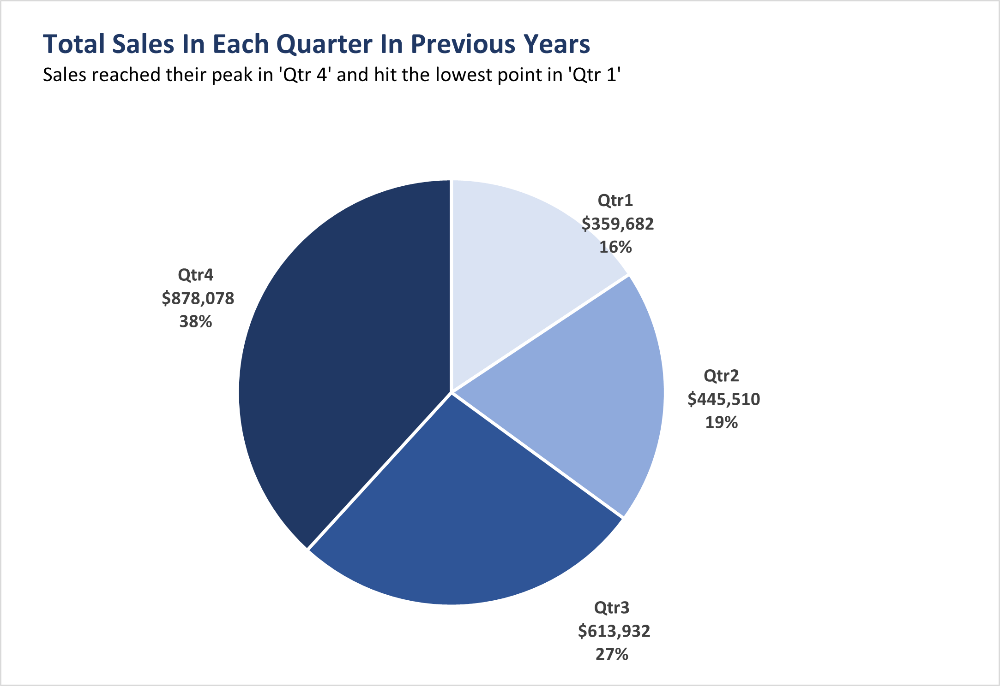
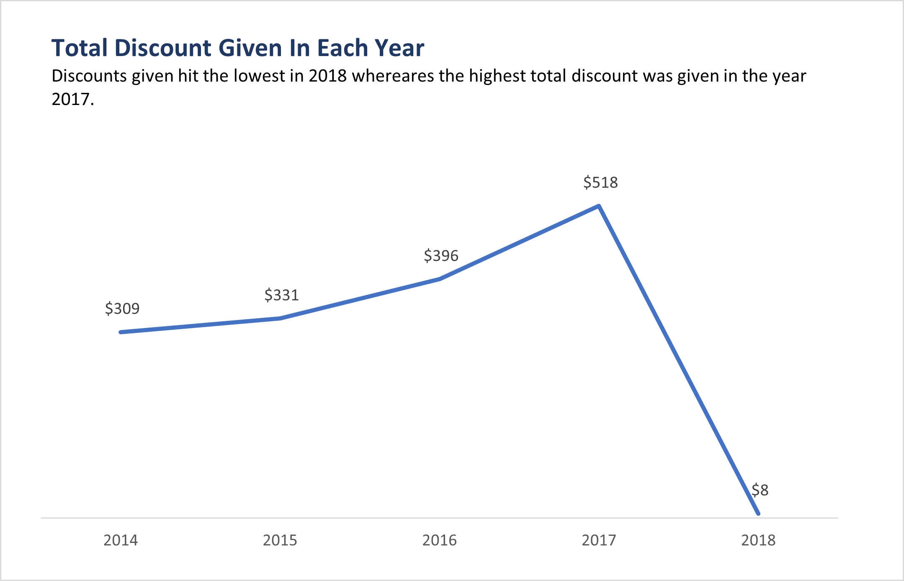

# U.S-Superstore-Business-Problem

## Introduction
In the dynamic landscape of the corporate world, where success hinges on data-driven strategies, the Manager at a **U.S. Superstore** has presented us with a compelling business problem. As we embark on a new fiscal year, armed with the hindsight of the previous year's sales performance, the imperative to identify crucial segments, quarters, months, products, or countries demands our attention. The crux of this analysis lies in unraveling the hidden patterns and insights within the data, guiding us towards a future defined by informed decisions and enanalysis will provide actionable insights and strategic recommendations to drive the store towards a successful and prosperous business ahead.

## Problem statement:
1. Which product category experienced the highest sales?
2. What was the sales trend by months in the previous year?
3. What were the total profits generated for each region?
4. During which two top quarters were the highest sales recorded in previous years?
5. Which year had the lowest total discounts awarded?
6. Which product category yielded the least amount of profit?

## Concepts Demonstrated 
Formulated six business inquiries which were addressed utilizing pivot tables, formulas and fuctions implementation, presenting visual displays with titles, subtitles and also included key performance indicators (KPIs).

## KPIs
Key performance indicators help in focusing attention on the most critical metrics that directly impact the overall performance and success of the business. It also provide a clear and quantifiable way to measure the success of an organization. The following KPIs were calculated using excel functions.
Total Profit = $286,397 
Total Sales	 = $2,297,201 
Total Quantity Of Goods Sold = $37,873 
Total Discounts given	= $1,561

## Solution To Questions
1. Which product category experienced the highest sales?

This shows that the category 'Technology' generated the highest sales in previous years.

2. What was the sales trend by months in the previous year?

This trend shows that the lowest sales were made in January and the highest sales were made in November. Apparently, the store needs to focus more on increasing sales in January.

3. What were the total profits generated for each region?

This chart shows that the highest profit were generated from the west and lowest profit were generated from central region.

4. During which two top quarters were the highest sales recorded in previous year?

This shows that highest sales were recorded in 'Qtr 4' and 'Qtr 3' in previous year

5. Which year had the lowest total discounts awarded?

This shows that 2018, the lowest discount was awarded.

6. Which product category yielded the least amount of profit?

This chart shows that the store is making the least profit in 'Furniture'

## Conclusion

In conclusion, addressing the business problem raised by the Manager at U.S Superstore is imperative as the company ventures into a new year. By analyzing sales performance across various segments, quarters, months, products, and countries, the organization can identify areas of potential improvement and make informed decisions for the upcoming year. Focusing on these specific areas will enable the company to optimize its strategies, enhance performance, and ultimately achieve better outcomes in the year ahead.
